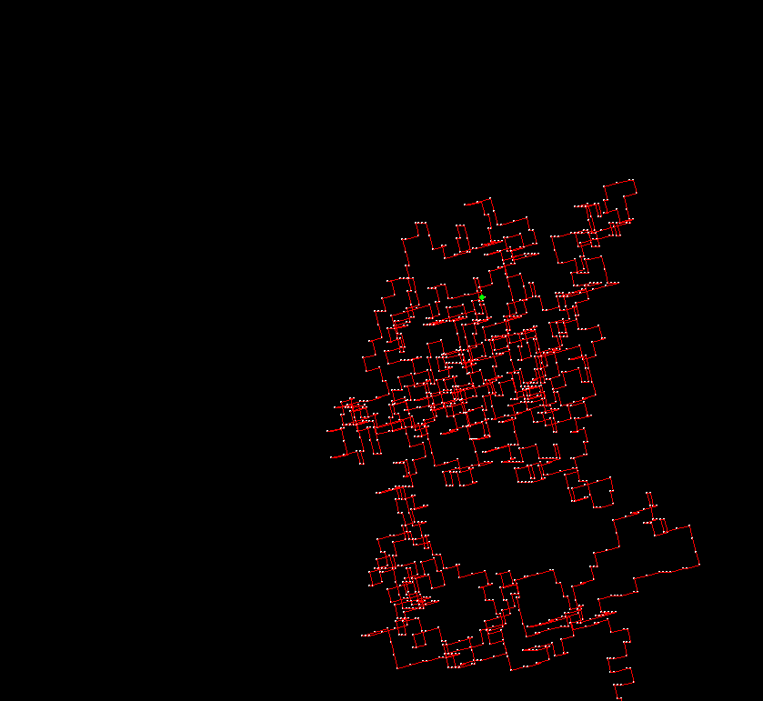

# 3D-Self-Avoiding-Walk-Simulation
3D Self-Avoiding Walk Simulation made with python using backtracking algorithm and rotation/projection matrices

# REQUIREMENTS
- python 3.x
- pygame
- numpy

# SCREENSHOT

